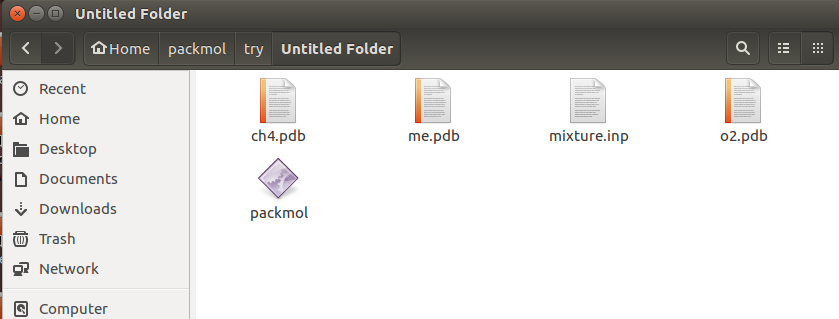
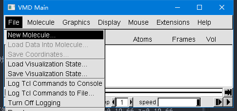
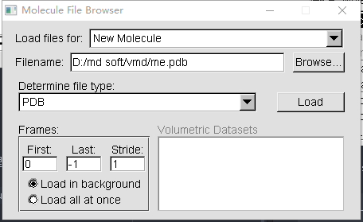

# 分子动力学模拟建模
建模主要分为两步
* 建立分子模型
* 建立box，投入分子
### 分子坐标文件
分子坐标文件主要由组成分子的每个原子的属性定义，包括原子类型、坐标、电荷等等，常用的分子坐标文件的格式有xyz、pdb、tinker等，不同格式之间稍加修改即可进行转换。

  常见的小分子可以通过gaussview、lammps等建立，生物大分子和复杂有机物有专门的数据库，如[RCSB Protein Data Bank](http://www.rcsb.org/pdb/home/home.do)

  我使用gaussview建模，导出为**ch4.pdb和o2.pdb**

  

以下是o2.pdb 文件的内容
  ```
  TITLE       Required
REMARK   1 File created by GaussView 5.0.9
HETATM    1  O           0      -0.874   1.505   0.000                       O
HETATM    2  O           0      -2.035   1.505   0.000                       O
END
CONECT    1    2
CONECT    2    1
```
### 建立box，投入分子
这一步通常是在给定大小的box中放入所需要数目的原子，通常根据需要计算出来。
通常体系密度 $\rho = \frac{\sum{M N} }{V}$ ,其中M是原子质量，N为原子数目，V是box的体积

PACKMOL 通过在定义的空间区域中堆积分子, 为分子动力学模拟创建所需的初始构型。PACKMOL需要上文建立的分子坐标文件（**ch4.pdb和o2.pdb**）以及一个输入文件 **mixture.inp**

输入文件mixture.inp如下
  ```
  tolerance 2.0          #规定原子间最小距离
  filetype pdb           #确定输出文件类型
  output me.pdb          #输出文件名

  structure ch4.pdb      #ch4
    number 20            #甲烷分子数
    inside box 0. 0. 0. 19.66 19.66 19.66     #甲烷分子的空间分布 x=0-19.66 y=0-19.66 z=0-19.66
  end structure

  structure o2.pdb        #氧气
    number 40             #氧气分子数
    inside box 0. 0. 0. 19.66 19.66 19.66     #氧气分子的空间分布 x=0-19.66 y=0-19.66 z=0-19.66
  end structure

  ```
随后在命令行中执行

```./packmol < mixture.inp ```

**注意执行时需要保证packmol、mixture.inp、ch4.pdb和o2.pdb在同一目录下**




生成模型，建立好的模型为.pdb格式，可以直接载入VMD ,查看模型是否合理。
##### VMD 读取模型步骤
1. 将**me.pdb**放到VMD的安装目录下，打开vmd，File => New Molecule,打开**me.pdb**

  

  

2. 打开Tk Console：Extensions =》 Tk COnsole，输入一下命令，将pdb文件转化为lammps的data文件

    ```topo writelammpsdata me.data```


  


这个data文件就是lammps所需要的模型文件。
