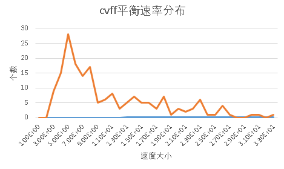
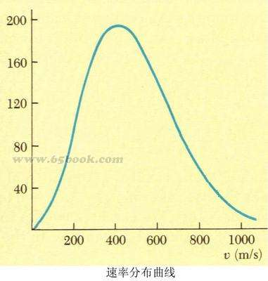

# LAMMPS 计算流程
上一篇生成data文件后，模型已经基本建立，下面讲一下LAMMPS计算参数的设定。
分子动力学模拟的一般过程为：建模 =》 能量最小化 =》 平衡 =》 迭代观察所研究的性质。我们所研究的REAXFF反应力场主要研究化学反应，为了保证反应开始前系统达到平衡状态，我们先使用CVFF力场进行平衡（不反应），再改为REAXFF力场研究反应。

### CVFF力场：能量最小化和平衡
CVFF力场的input文件如下：
```
#cvff
###### 设置cvff力场
units		real
atom_style	full
kspace_style	ewald 1e-4
pair_style	lj/cut/coul/long 10 8
bond_style	harmonic
angle_style	harmonic
#######读取模型，给予初始速度
read_data	20c.data
velocity 	all create 60.0 4928459 mom yes dist gaussian
timestep	0.25
thermo    	10000
########能量最小化
fix		1 all nve
fix             2 all temp/berendsen 30.0 30.0 100.0
timestep	0.25
minimize	1.0e-6 0.001 1000 10000
dump		1 all atom 1000 cvff.trj
######## 平衡
unfix		2
velocity 	all create 6000.0 4928459 mom yes dist gaussian
fix		3 all temp/berendsen 3000.0 3000.0 100.0
run		1000000
########输出平衡的模型，退出
write_data  	20c_equil.data
quit		1

```




### REAXFF力场：进行反应
```
#reaxff
########读取模型，设置力场参数
units		real
atom_style	full
read_data	AE.data
pair_style	reax/c lmp_control
pair_coeff	* * ffield.reax.cho  C H O
########控温3000K
fix		1 all nvt temp 3000.0 3000.0 100.0
fix             3 all qeq/reax 1 0.0 10.0 1e-6 param.qeq
thermo    	10000
timestep	0.1
dump		1 all atom 1000 ae.trj
########设置循环，每100万步输出一次restart文件
variable	i loop 10
label		lp
run		1000000
write_restart 	$im.restart
next		i
jump		SELF lp
quit 		1
```
